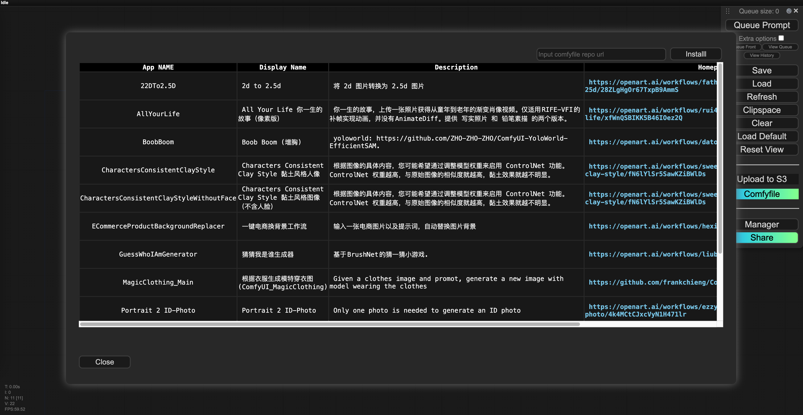
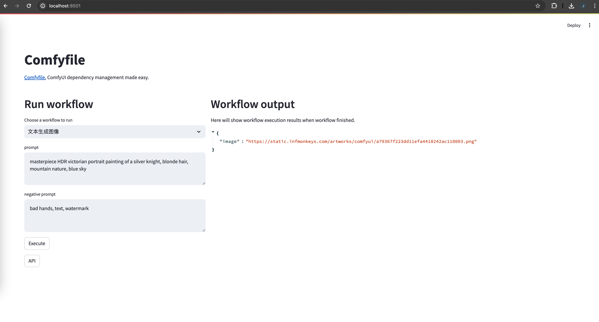
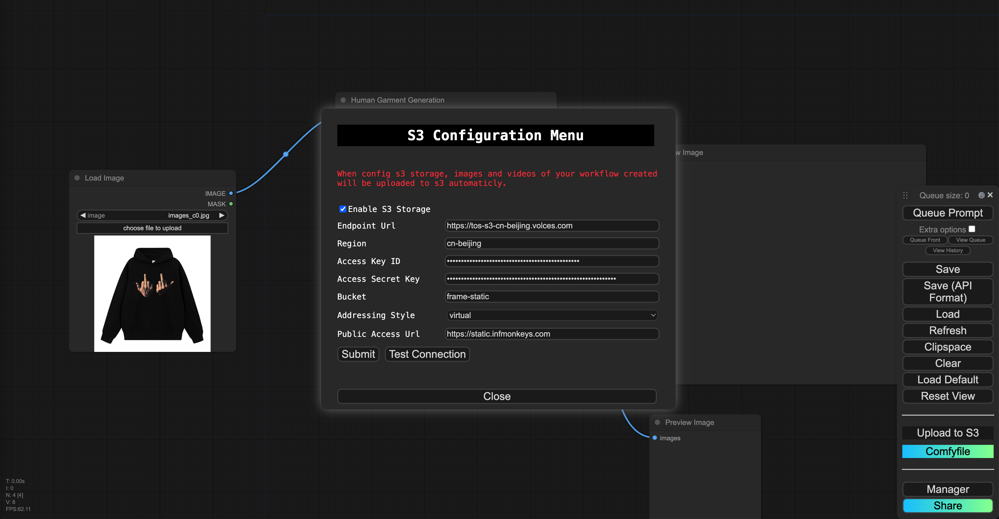

<div align="center">

# Comfyfile

[](http://www.apache.org/licenses/LICENSE-2.0)
[](https://GitHub.com/inf-monkeys/Comfyfile/stargazers/)
[](https://github.com/inf-monkeys/Comfyfile)

ComfyUI dependency management made easy.

</div>

# Screenshots








# Example Comfyfile

> For [https://github.com/frankchieng/ComfyUI_MagicClothing](https://github.com/frankchieng/ComfyUI_MagicClothing), see [MagicClothing](./workflows/MagicClothing/Comfyfile) for more.

```txt
STAGE build

PLUGIN https://github.com/frankchieng/ComfyUI_MagicClothing

SCRIPT ./fix_requirements.sh

RUN pip install -r custom_nodes/ComfyUI_MagicClothing/requirements.txt

MODEL models/ipadapter/ip-adapter-faceid-plus_sd15.bin https://weights.replicate.delivery/default/comfy-ui/ipadapter/ip-adapter-faceid-plus_sd15.bin.tar
MODEL models/ipadapter/ip-adapter-faceid-plusv2_sd15.bin https://weights.replicate.delivery/default/comfy-ui/ipadapter/ip-adapter-faceid-plusv2_sd15.bin.tar
MODEL models/ipadapter/ip-adapter-faceid_sd15.bin https://weights.replicate.delivery/default/comfy-ui/ipadapter/ip-adapter-faceid_sd15.bin.tar
MODEL models/loras/ip-adapter-faceid-plus_sd15_lora.safetensors https://weights.replicate.delivery/default/comfy-ui/ipadapter/ip-adapter-faceid-plus_sd15_lora.safetensors.tar
MODEL models/loras/ip-adapter-faceid-plusv2_sd15_lora.safetensors https://weights.replicate.delivery/default/comfy-ui/ipadapter/ip-adapter-faceid-plusv2_sd15_lora.safetensors.tar
MODEL models/loras/ip-adapter-faceid_sd15_lora.safetensors https://weights.replicate.delivery/default/comfy-ui/ipadapter/ip-adapter-faceid_sd15_lora.safetensors.tar
MODEL custom_nodes/ComfyUI_MagicClothing/checkpoints/cloth_segm.pth https://huggingface.co/ShineChen1024/MagicClothing/resolve/main/cloth_segm.pth
MODEL custom_nodes/ComfyUI_MagicClothing/checkpoints/magic_clothing_768_vitonhd_joint.safetensors https://huggingface.co/ShineChen1024/MagicClothing/resolve/main/magic_clothing_768_vitonhd_joint.safetensors
MODEL custom_nodes/ComfyUI_MagicClothing/checkpoints/OMS_1024_VTHD+DressCode_200000.safetensors https://huggingface.co/ShineChen1024/MagicClothing/resolve/main/OMS_1024_VTHD%2BDressCode_200000.safetensors
MODEL custom_nodes/ComfyUI_MagicClothing/checkpoints/stable_ckpt/garment_extractor.safetensors https://huggingface.co/ShineChen1024/MagicClothing/resolve/main/stable_ckpt/garment_extractor.safetensors
MODEL custom_nodes/ComfyUI_MagicClothing/checkpoints/stable_ckpt/ip_layer.pth https://huggingface.co/ShineChen1024/MagicClothing/resolve/main/stable_ckpt/ip_layer.pth

COPY images/ input/

STAGE serve

APP_NAME MagicClothing_Main
MANIFEST ./apps/main/manifest.json
WORKFLOW ./apps/main/workflow.json
WORKFLOW_API ./apps/main/workflow_api.json
REST_ENDPOINT ./apps/main/rest_endpoint.json
```